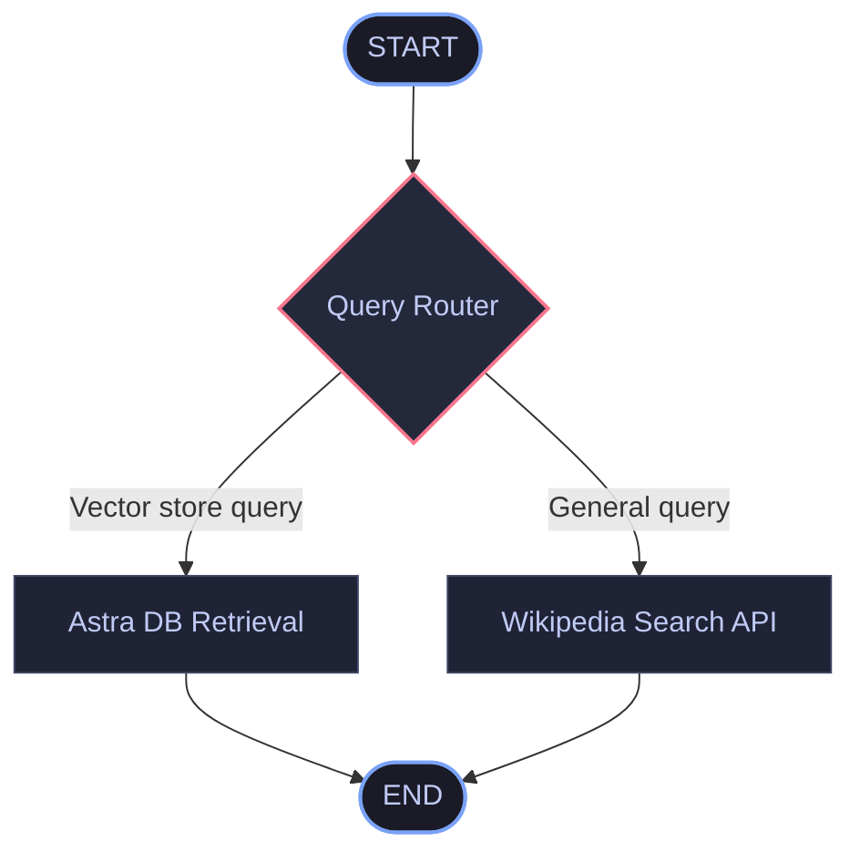

# End-to-End RAG Application with LangGraph & Astra DB

An advanced, production-grade Retrieval-Augmented Generation (RAG) system built using **LangGraph** for workflow orchestration, **Astra DB** (Apache Cassandra) for cloud-native vector storage, and **Groq Cloud (Llama 3.3)** for lightning-fast inference and query routing.

This application demonstrates how to build a stateful, multi-agent style workflow that dynamically routes user queries to the most appropriate datasource—either an internal vector database (for specialized topics like LLM agents, prompt engineering, and adversarial attacks) or a search engine fallback (Wikipedia API) for general queries.

---

## 🏗️ System Architecture

The following diagram illustrates the flow of a user query through the LangGraph StateGraph:



---

## ✨ Features

- **Dynamic Query Routing**: Evaluates user queries using Groq's `llama-3.3-70b-versatile` LLM with structured Pydantic outputs (`RouteQuery`) to route to the correct node.
- **Cloud-Native Vector Storage**: Leverages **Astra DB** (powered by Apache Cassandra) through the `cassio` library for high-scale document storage and similarity searches.
- **Stateful Orchestration**: Implements **LangGraph** `StateGraph` to manage graph state transitions cleanly and visually.
- **Hugging Face Embeddings**: Generates document embeddings locally using `all-MiniLM-L6-v2` for precise semantic matching.
- **Wikipedia Fallback Integration**: Seamlessly retrieves real-time summaries from Wikipedia when questions fall outside the specialized knowledge domain.

---

## 🛠️ Tech Stack

- **Core Framework**: `langchain`, `langgraph`, `langchain_community`
- **Vector Database & Connections**: `cassio`, Astra DB (Apache Cassandra)
- **Large Language Model (LLM)**: Groq (`llama-3.3-70b-versatile`)
- **Embeddings Model**: Hugging Face (`sentence-transformers/all-MiniLM-L6-v2`)
- **Fallback Tools**: Wikipedia API Wrapper

---

## 🚀 Setup & Installation

### 1. Clone & Navigate
Navigate to the project directory:
```bash
cd "Langraph/End To End Rag Application With Langgraph"
```

### 2. Configure Virtual Environment
Create and activate a Python virtual environment:
```bash
# On macOS/Linux
python3 -m venv venv
source venv/bin/activate

# On Windows
python -m venv venv
venv\Scripts\activate
```

### 3. Install Dependencies
Install all required libraries listed in `requirements.txt`:
```bash
pip install -r requirements.txt
```

### 4. Environment Variables Setup
Create a `.env` file in the root of the project directory with the following variables:
```env
# Groq LLM Key
GROQ_API_KEY="your_groq_api_key"

# Hugging Face Access Token
HF_TOKEN="your_huggingface_token"

# Astra DB Credentials
ASTRA_DB_ID="your_astra_db_id"
ASTRA_DB_APPLICATION_TOKEN="your_astra_db_application_token"

# LangSmith Tracing (Optional but recommended)
LANGCHAIN_TRACING_V2="true"
LANGCHAIN_API_KEY="your_langchain_api_key"
LANGCHAIN_PROJECT="LangGraph-RAG-AstraDB"
```

---

## 📖 Step-by-Step Implementation Flow

The application executes through `langgraph_astra.ipynb` in these steps:

1. **Astra DB Initialization**: Sets up a Cassandra session using `cassio` with the `ASTRA_DB_APPLICATION_TOKEN` and `ASTRA_DB_ID`.
2. **Data Loader & Document Chunking**: Reads blog content (e.g., Lilian Weng's *LLM Powered Autonomous Agents*) via `WebBaseLoader` and splits it using `RecursiveCharacterTextSplitter`.
3. **Embedding Generation**: Initializes `HuggingFaceEmbeddings` and indexes the text chunks into Astra DB under the table `qa_mini_demo`.
4. **LLM Query Router Configuration**:
   - Uses `RouteQuery` Pydantic model to output either `vectorstore` or `wiki_search`.
   - Binds the schema to `llm.with_structured_output(RouteQuery)`.
5. **Graph Definition**:
   - Defines `GraphState` containing `question`, `generation`, and `documents`.
   - Creates nodes: `retrieve` and `wiki_search`.
   - Configures a conditional edge `route_question` originating from `START` to decide routing.
6. **Execution & Streaming**: Uses `.stream()` on the compiled graph application to run queries, print the active execution nodes, and show results.

---

## 🖥️ Usage

Run the Jupyter Notebook:
```bash
jupyter notebook langgraph_astra.ipynb
```
Follow and execute the cells step-by-step to ingest data and query the graph workflow!

### Example Query Routing Behaviors:
- **Query**: *"What are the types of agent memory?"*
  - **Route**: `---ROUTE QUESTION TO RAG---` ➡️ `---RETRIEVE---` (Fetches context from Astra DB).
- **Query**: *"Who is Cristiano Ronaldo?"*
  - **Route**: `---ROUTE QUESTION TO Wiki SEARCH---` ➡️ `---wiki_search---` (Retrieves summary from Wikipedia).
